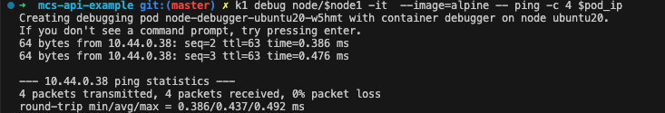
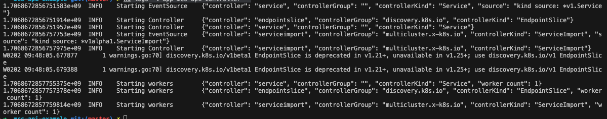
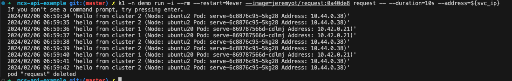

# MCS-API 在 Rancher 上的演示应用

本文将给大家介绍如何使用 mcs-api-controller 打通两个集群的服务发现。

## 背景介绍

在我们的 Kubernetes 集群运行一段时间后，集群里面会按照规划部署各种各样的业务应用。此时我们遇到升级 Kubernetes 集群版本时，难免需要评估升级的风险与影响。特别在我们的老集群已经落后主线数个版本时，升级集群版本的过程中就可能会带来风险。而版本老旧的集群又有可能存在 CVE 安全风险，给集群运维人员带来日常运维的压力。  
当我们面对上面的问题时，我们可以变换思路，通过冗余的资源，搭建新版本集群对应用进行迁移。这样就能减少由原地升级带来的操作过程中的风险，并通过升级解决集群存在的 CVE 安全隐患，一举两得。

但理想很丰满，现实却很骨感。迁移工作不可能一蹴而就，在严苛的运维窗口期不可能将所有的应用一次迁移完成，此时我们就需要新老集群同时运行，还需要保证应用互相访问的能力。本文将以这个目标进行演示，介绍 mcs-api 的工作模式与原理。

示例代码仓库：[https://github.com/orangedeng/mcs-api-example](https://github.com/orangedeng/mcs-api-example)

## 环境准备

| 环境信息    | 版本             |
| ----------- | ---------------- |
| Rancher     | v2.6.13          |
| RKE         | v1.21.14         |
| OS for rke1 | ubuntu 20.04-LTS |
| RKE2        | v1.24.17+rke2r1  |
| OS for rke2 | ubuntu 22.04-LTS |
| mcs-api     | v0.1.0(patched)  |

为了更贴合场景，我们新老集群分别使用了 rke1 与 rke2 两种不同的发行版。由于 rke1 无法直接升级到 rke2，这是一个很具有参考意义的场景。以下是新老集群的配置需求：

| 配置项         | 老集群                | 新集群                                               |
| -------------- | --------------------- | ---------------------------------------------------- |
| network plugin | `canal`/`flannel`     | `canal`/`multus + canal`/`multus + 其他` + `flannel` |
| clusterCIDR    | 10.42.0.0/16(default) | 10.44.0.0/16                                         |
| serviceCIDR    | 10.43.0.0/16(default) | 10.45.0.0/16                                         |

错开 clusterCIDR 与 serviceCIDR 是必要的手段，在本示例中也会通过简单的方法打通两个集群的网络访问，也因此我们在网络插件中使用了 `flannel`。

mcs-api 项目地址为：[https://github.com/kubernetes-sigs/mcs-api](https://github.com/kubernetes-sigs/mcs-api)，在项目的 readme 中介绍了如何构建该项目，本次使用的 mcs-api 版本经过了 patch，修复了无法使用 leader-election 功能的问题。

```
diff --git a/cmd/servicecontroller/servicecontroller.go b/cmd/servicecontroller/servicecontroller.go
index ae427aa..49c24bd 100644
--- a/cmd/servicecontroller/servicecontroller.go
+++ b/cmd/servicecontroller/servicecontroller.go
@@ -42,15 +42,18 @@ func init() {
 func main() {
 	var metricsAddr string
 	var enableLeaderElection bool
+	var leaderElectionID string
 	flag.StringVar(&metricsAddr, "metrics-addr", ":8080", "The address the metric endpoint binds to.")
 	flag.BoolVar(&enableLeaderElection, "enable-leader-election", false,
 		"Enable leader election for controller manager. Enabling this will ensure there is only one active controller manager.")
+	flag.StringVar(&leaderElectionID, "leader-election-id", "mcs-api-controller", "The ID for leader election.")
 	flag.Parse()
 	opts := ctrl.Options{
 		Scheme:             scheme,
 		MetricsBindAddress: metricsAddr,
 		LeaderElection:     enableLeaderElection,
 		Port:               9443,
+		LeaderElectionID:   leaderElectionID,
 	}
 	ctrl.SetLogger(zap.New(zap.UseDevMode(true)))
```

通过 `git apply` 这个 diff 内容后，使用 `make docker-build` 命令即可构建出可以多副本运行的 mcs-api-controller。本次使用的镜像 `orstar/mcs-api-controller:v0.1.0-20240201` 也是在应用 patch 之后进行构建。

演示环境准备前置：

```
git clone https://github.com/orangedeng/mcs-api-example
cd mcs-api-example
# 检查 kubectl 版本，需要大于 v1.24
kubectl version --client
# 检查 python 版本，用于执行脚本，需要大于 python 3.7
python --version
# 安装 pyyaml 依赖
pip install pyyaml
```

## 操作步骤

下面的演示步骤，默认在示例代码仓库克隆下来的地址下运行。

1. 在 Rancher 中搭建新旧集群，此处不做赘述，安装 Rancher 以及创建集群的步骤可以参考[文档 https://ranchermanager.docs.rancher.com/zh/v2.6](https://ranchermanager.docs.rancher.com/zh/v2.6)。集群搭建完成后，分别获取集群的 kubeconfig。
   - rke1 集群对应的 kubeconfig 保存为 `kubeconfig1`，并在 bash shell 中设置 shortcut：`alias k1="kubectl --kubeconfig ${PWD}/kubeconfig1"`
   - rke2 集群对应的 kubeconfig 保存为 `kubeconfig2`，并在 bash shell 中设置 shortcut：`alias k2="kubectl --kubeconfig ${PWD}/kubeconfig2"`
1. 检查集群状态，分别运行 `kubectl get no`

   rke1:

   ```
   # k1 get no
   NAME       STATUS   ROLES                      AGE   VERSION
   ubuntu20   Ready    controlplane,etcd,worker   27h   v1.21.14
   ```

   rke2:

   ```
   # k2 get no
   NAME      STATUS   ROLES                              AGE   VERSION
   ubuntu2   Ready    control-plane,etcd,master,worker   11m   v1.24.17+rke2r1
   ```

   此时可以看到两个集群的节点都已经 ready，可以进行下一步操作

1. 部署用于返回数据的 deployment

   ```
   # rke1 cluster
   k1 create ns demo
   k1 apply -f manifests/demo/c1_serve.yaml -f manifests/demo/svc.yaml
   # rke2 cluster
   k2 create ns demo
   k2 apply -f manifests/demo/c2_serve.yaml -f manifests/demo/svc.yaml
   ```

   此时 rke1 与 rke2 集群中分别都部署了一个 serve 服务以及对应的 service。

1. 通过 flannel 机制打通两个集群的网络。  
    由于我们在两个集群中都使用了 `flannel` 网络模式并错开了 clusterCIDR，所以我们在节点上添加路由即可完成集群 overlay 的互通。这里我们使用与 `flannel` vxlan 相同的方式，让两个集群之间的容器网络相互联通。

   ```
   node1=$(k1 get no -o jsonpath="{.items[0]}")
   node1_ip=$(echo $node1 | jq -r '.metadata.annotations["flannel.alpha.coreos.com/public-ip"]')
   node1_mac=$(echo $node1 | jq -r '.metadata.annotations["flannel.alpha.coreos.com/backend-data"]' | jq -r '.VtepMAC')
   node1_subnet=$(echo $node1 | jq -r '.spec.podCIDR')
   echo $node1_ip $node1_mac $node1_subnet
   # should be like
   # 192.168.31.66 0e:b5:f8:b4:1c:a3 10.42.0.0/24

   node2=$(k2 get no -o jsonpath="{.items[0]}")
   node2_ip=$(echo $node2 | jq -r '.metadata.annotations["flannel.alpha.coreos.com/public-ip"]')
   node2_mac=$(echo $node2 | jq -r '.metadata.annotations["flannel.alpha.coreos.com/backend-data"]' | jq -r '.VtepMAC')
   node2_subnet=$(echo $node2 | jq -r '.spec.podCIDR')
   echo $node2_ip $node2_mac $node2_subnet
   # should be like
   # 192.168.31.95 ba:7e:3d:4c:18:eb 10.44.0.0/24

   # create node2 config in k1 cluster
   k1 create configmap node-config \
    --from-literal=node_ip=$node2_ip \
    --from-literal=node_mac=$node2_mac \
    --from-literal=node_subnet=$node2_subnet \
    --from-literal=cidr1="10.42.0.0/16" \
    --from-literal=cidr2="10.44.0.0/16"
   # create node1 config in k2 cluster
   k2 create configmap node-config \
    --from-literal=node_ip=$node1_ip \
    --from-literal=node_mac=$node1_mac \
    --from-literal=node_subnet=$node1_subnet \
    --from-literal=cidr1="10.42.0.0/16" \
    --from-literal=cidr2="10.44.0.0/16"

   # create script in configmap
   k1 create configmap host-network-script --from-file=scripts/create-routes.sh
   k2 create configmap host-network-script --from-file=scripts/create-routes.sh

   # running network modify script and wait for pod completed
   k1 apply -f manifests/demo/modify-network.yaml
   k1 wait --for=condition=Ready pod/host-network-modifier --timeout=30s

   k2 apply -f manifests/demo/modify-network.yaml
   k2 wait --for=condition=Ready pod/host-network-modifier --timeout=30s
   ```

   至此两个集群的网络营应该已经连通，我们使用 `kubectl debug node` 来进行测试：

   ```
   pod_ip=$(k2 get po -n demo -o jsonpath="{.items[0].status.podIP}")
   node1=$(k1 get no -o jsonpath="{.items[0].metadata.name}")
   k1 debug node/$node1 -it  --image=alpine -- ping -c 4 $pod_ip
   ```

   成功的话可以看到从 rke1 node 创建的 debug pod 成功 ping 到 rke2 集群的 pod。

   

1. 在 rke1 集群中部署 mcs-api-controller。如需要从 rke2 集群访问 rke1 的服务，该操作也可以应用于 rke2 集群。

   ```
   # the mcs-api-controller will be deployed into default namespace
   k1 apply -R -f manifests/mcs-api-controller
   # you can see the logs for the controller to check the state
   k1 logs -l app=mcs-api-controller
   ```

   正常情况下查看日志会返回以下内容：
   

1. 获取新老集群中的 serve 服务对应的 `endpointslice` 并在 rke1 集群中创建 `serviceimport`

   ```
   # get endpoint slice name
   ep_1=$(k1 get endpointslice -n demo -l 'kubernetes.io/service-name=serve' --template="{{(index .items 0).metadata.name}}")
   ep_2=$(k2 get endpointslice -n demo -l 'kubernetes.io/service-name=serve' --template="{{(index .items 0).metadata.name}}")
   # create service import in rke1 cluster
   k1 apply -f manifests/demo/serviceimport.yaml

   # import endpoint slice from rke1 and rke2 to rke1
   k1 get endpointslice $ep_1 -n demo -o yaml | scripts/edit-meta.py --metadata "{name: imported-${ep_1}, namespace: demo, labels: {multicluster.kubernetes.io/service-name: serve}}" | k1 apply -f -
   k2 get endpointslice $ep_2 -n demo -o yaml | scripts/edit-meta.py --metadata "{name: imported-${ep_2}, namespace: demo, labels: {multicluster.kubernetes.io/service-name: serve}}" | k1 apply -f -
   ```

   创建完成后，rke1 集群中的 `serviceimport` demo/serve 对象，已经通过 labels 关联了 `endpointslice`。下一步我们将测试这个 service 的可达性。

   ```
   # get serviceimport's service ip
   svc_ip=$(k1 get serviceimport -n demo -o go-template --template='{{index (index .items 0).spec.ips 0}}')
   # connect to svc ip
   k1 -n demo run -i --rm --restart=Never --image=jeremyot/request:8680343 request -- --duration=10s --address=${svc_ip}
   ```

   请求 vip 后，能看到以下返回，请求 vip 可以同时由 rke1 与 rke2 提供服务：  
   

   至此我们已经完成整个 demo 的演示与配置。

## 总结

在上述的演示过程中，我们手工完成了新老集群的网络打通，以及对 cs-api-controller 的配置，并且通过在 rke1 集群中访问 mcs 的 service ip，同时让新老集群中的 pod 提供服务。在实际的运维过程中，可以参考这个例子来搭建更适合各自应用环境的方案。

### Q&A

1. mcs-api 有什么具体实现吗？

   答：我了解到有两个方案：

   - [submariner](https://github.com/submariner-io/submariner) 的子组件 lighthouse；submariner 作为 multi-cluster network 的联通方案，多集群服务发现是其重要特性中的一环。
   - [karmada](https://karmada.io/) 的 mcs-api 实现；karamda 以多集群运行 cloud-native app 为目标设计，mcs-api 也是作为其服务组件，提供对应的功能实现。

   submariner 在网络上使用了类似对等网关的技术，分别在各自集群中运行一个 gateway pod，并建立 tunnels(ipset/wiregrade/vxlan)，跨集群的流量将从这个 tunnel 中通过。这样的模式会使得在看重网络性能的场景下无法充分发挥基础架构中的底层网络优势，gateway pod 容易成为性能瓶颈。

1. 为什么使用 rke1 v1.21.14 版本，不能是更老的版本吗？

   答：mcs-api 依赖 `coordination.k8s.io/v1` API group，在 v1.21 版本中标记为 stable

1. 在打通集群网络时，为什么使用了与 flannel vxlan 一致的方式，而不是直接在路由表上添加对端集群的路由？如 10.44.0.0 -> rke2-node-ip

   答：这里主要是希望充分利用 flannel vxlan 的优势，即使两个集群主机网段不一致，无需额外配置即可使用。当然如果使用 `DirectRouting` 这种模式的性能更好。

1. `create-routes.sh` 这个脚本主要做了什么？

   答：基本按照 flannel 网络的设计添加了对应的网络配置

   - 添加 arp 表，使得 host 网络中能在二层发现对端集群节点，如 10.44.0.0 -> vxlan_vtep_mac。
   - 添加路由表，使得发送到对端集群节点对应的 podcidr 网段的数据包，都会发送到 vxlan_vtep 中，如 10.44.0.0/24 -> vxlan_vtep。
   - 添加 fdb 表(forwarding database)，由于 vxlan 的 vetp link 到主机网卡时设置了 nolearning 属性，我们需要手工维护对端集群节点的 vxlan_vtep_mac 到目标 IP 地址，让 kernel 知道发往 vtep mac 的数据包需要往哪个实际的 ip 地址投递，如：on rke1 node1, node2_vxlan_vtep_mac -> node2_ip。
   - 维护 iptables nat 表，对来往两个集群的数据包不作 masq 处理，使得两个集群中的 pod 间通讯可以看到对端的实际 ip。
